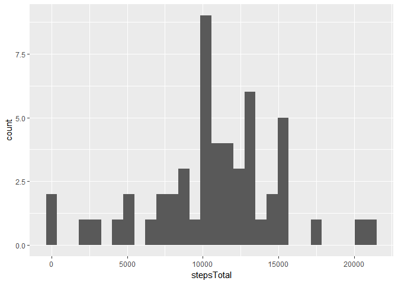
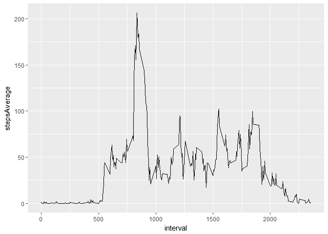
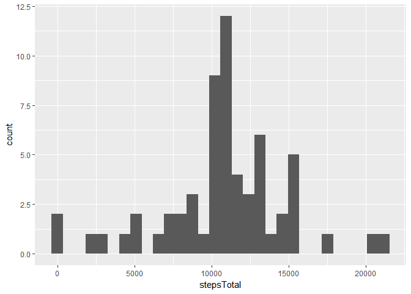
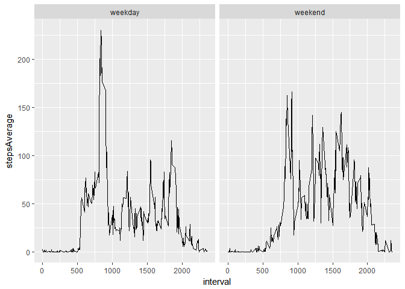

# PA1_template


## Loading and preprocessing the data
Reading the data, converting date variable to a Date type. 
Also converting steps from integer to numeric in order to impute missed values with means (means will be numeric).

```r
library(data.table)
library(ggplot2)
dt<-fread("activity.csv", na.strings = "NA", sep=",")

dt[,"date"]<-dt[,lapply(.SD,strptime,format = "%Y-%m-%d"), .SDcols=c("date")]
dt<-dt[, steps:=as.numeric(steps)]
```

Removing rows containing NA.

```r
dt2<-na.omit(dt)
head(dt2)
```

```
##    steps       date interval
## 1:     0 2012-10-02        0
## 2:     0 2012-10-02        5
## 3:     0 2012-10-02       10
## 4:     0 2012-10-02       15
## 5:     0 2012-10-02       20
## 6:     0 2012-10-02       25
```

## What is mean total number of steps taken per day?
Calculating total number of steps per day.

```r
dtStepsPerDay<-dt2[,list(stepsTotal=sum(steps)), by=date]
head(dtStepsPerDay)
```

```
##          date stepsTotal
## 1: 2012-10-02        126
## 2: 2012-10-03      11352
## 3: 2012-10-04      12116
## 4: 2012-10-05      13294
## 5: 2012-10-06      15420
## 6: 2012-10-07      11015
```
Calculating the mean and median.

```r
dtStepsPerDay[,list(mean=mean(stepsTotal), median=median(stepsTotal))]
```

```
##        mean median
## 1: 10766.19  10765
```
Histogram of the total number of steps taken each day.

```r
qplot(stepsTotal, data=dtStepsPerDay)
```

```
## `stat_bin()` using `bins = 30`. Pick better value with `binwidth`.
```

<!-- -->

## What is the average daily activity pattern?
Calculating the average number of steps taken, averaged across all days (y-axis).

```r
dtAvStepsPerInt<-dt2[,list(stepsAverage=mean(steps)), by=c("interval")]
head(dtAvStepsPerInt)
```

```
##    interval stepsAverage
## 1:        0    1.7169811
## 2:        5    0.3396226
## 3:       10    0.1320755
## 4:       15    0.1509434
## 5:       20    0.0754717
## 6:       25    2.0943396
```
Timeseries plot of the 5-minute interval (x-axis) and the average number of steps taken, averaged across all days (y-axis).

```r
ggplot(dtAvStepsPerInt, aes(interval, stepsAverage))+geom_line(linetype = "solid")
```

<!-- -->

Finding the interval with maximum number of steps.

```r
dtAvStepsPerInt[which.max(stepsAverage),]
```

```
##    interval stepsAverage
## 1:      835     206.1698
```
It's the 8:35 - 8:40 interval.

## Imputing missing values
Firstly, let's report the number of missing values for each column.

```r
sapply(dt, function(x) sum(is.na(x)))
```

```
##    steps     date interval 
##     2304        0        0
```
Only steps variable contains missing values. Let's fill it with interval means.

```r
impute.mean <- function(x) replace(x, is.na(x), mean(x, na.rm = TRUE))
dtImpute<-dt[,steps:=impute.mean(steps), by=interval]
head(dtImpute)
```

```
##        steps       date interval
## 1: 1.7169811 2012-10-01        0
## 2: 0.3396226 2012-10-01        5
## 3: 0.1320755 2012-10-01       10
## 4: 0.1509434 2012-10-01       15
## 5: 0.0754717 2012-10-01       20
## 6: 2.0943396 2012-10-01       25
```
Calculating the mean and median for imputed data.

```r
dtStepsPerDayImpute<-dtImpute[,list(stepsTotal=sum(steps)), by=date]
dtStepsPerDayImpute[,list(mean=mean(stepsTotal), median=median(stepsTotal))]
```

```
##        mean   median
## 1: 10766.19 10766.19
```
The mean remained the same, as it should. It's easy to prove. Let k be the total number of full rows and n 
the total number of NA-rows, S_i the summ of steps in i-interval. So the mean of clean data is summ(S_i)/k.
The mean of imputed data is summ(S_j)/(n+k) = summ(S_i+n*S_i/k)/(n+k) due to the algorithm of imputting. 
These expressions are equal. 

The median of imputted data is greater than for clean data, 
because the sum(steps) containes additional items, which are missing for clean data. 
For example, if there are 3 (for simplicity) observations in a particular day: 1,2, NA,
for clean data the sum(steps)=1+2=3, but for imputed data sum(steps)=1+2+some positive number.
So the whole variational series and consequently the median of imputed data are right-shifted.
The equality of the mean and the median is quite surprising. But the code works properly.


```r
qplot(stepsTotal, data=dtStepsPerDayImpute)
```

```
## `stat_bin()` using `bins = 30`. Pick better value with `binwidth`.
```

<!-- -->

The imputed data is more concentrated in the center of distribution due to the algorithm of filling.

## Are there differences in activity patterns between weekdays and weekends?
In this chunk I create the 2-factor variable weekdayFactor. 
After there goes a calculation of average number of steps grouped by interval and weekdayFactor.

```r
weekdayFactor<-function(x){
        weekend<-c("Saturday","Sunday")
        if (is.element(weekdays(x),weekend)) return("weekend")
                else return("weekday")
}
f<-function(y) lapply(y, weekdayFactor)
dtImpute[,weekdayFactor:=f(date),]
dtImpute[,weekdayFactor:=as.factor(unlist(weekdayFactor))]
dtImpute<-dtImpute[,c("steps", "interval", "weekdayFactor")]
dtAvStepsPerInt<-dtImpute[,mean(steps), by=list(interval, weekdayFactor)]
setnames(dtAvStepsPerInt, "V1", "stepsAverage")
head(dtAvStepsPerInt)
```

```
##    interval weekdayFactor stepsAverage
## 1:        0       weekday   2.25115304
## 2:        5       weekday   0.44528302
## 3:       10       weekday   0.17316562
## 4:       15       weekday   0.19790356
## 5:       20       weekday   0.09895178
## 6:       25       weekday   1.59035639
```
Plot of the 5-minute interval (x-axis) and the average number of steps taken, averaged across all weekday days or weekend days (y-axis). 

```r
ggplot(dtAvStepsPerInt, aes(interval, stepsAverage))+geom_line(linetype = "solid")+facet_grid(.~weekdayFactor)
```

<!-- -->

There is less activity in early hours and more in the middle of the day during the weekend, in contrast to weekdays. 
